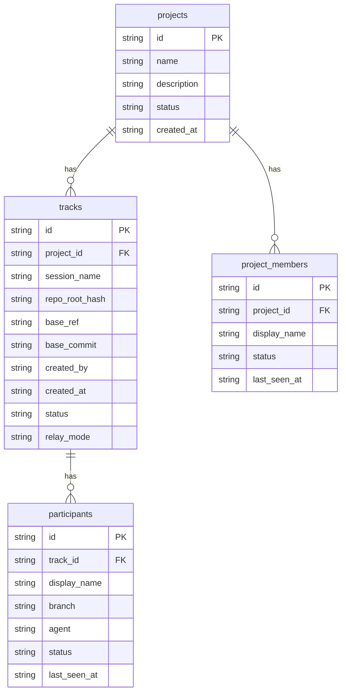
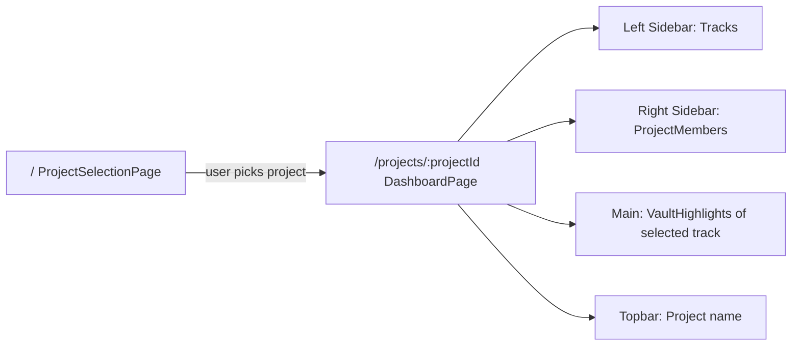

# feat: Introduce Project hierarchy, rename Workspace → Track

## Summary

The app's current "workspace" concept is a leaf-level session tied to a git worktree. The user needs a **Project** layer above it: a project groups multiple **Tracks** (renamed workspaces), members belong at the project level (status/PFP/activity are project-scoped), and the dashboard opens with a project-selection screen before reaching the per-track view. The topbar shows the project name. All existing dummy data is replaced with realistic multi-project seed data.

---

## Problem Frame

- "Workspace" is opaque — it describes a git session, not a meaningful unit of team work.
- Members currently exist per-workspace; there is no shared identity across tracks of the same project.
- The dashboard drops users directly into a single workspace with no project context.
- Dummy data is synthetic and disconnected; it does not demonstrate the product story.

**Desired hierarchy:**
```
Project
  └── Track  (renamed workspace: a scoped piece of work, e.g. "Auth Redesign", "Q1 Build")
        └── Vault content: decisions / observations / blockers / attempts
```

Members live at the **Project** level. A member's status, PFP, and activity are tied to the project. Which track they are currently active in is incidental detail surfaced via events, not a separate membership.

---

## Requirements

- R1: `Project` type exists in `@coord/core` with id, name, description, createdAt, status.
- R2: `Workspace` type is renamed to `Track` throughout core contracts, daemon, vault, and dashboard.
- R3: Each Track has a `projectId` foreign key.
- R4: `ProjectMember` type exists in `@coord/core` — participant with project-level status (active/idle/offline), PFP, displayName.
- R5: Daemon exposes project CRUD endpoints and project-member endpoints.
- R6: Dashboard has a project-selection page at `/` that navigates to `/projects/:projectId`.
- R7: Dashboard's topbar shows the project name, not the track name.
- R8: Right sidebar shows project members (project-scoped), not per-track participants.
- R9: Left sidebar shows tracks within the selected project.
- R10: All old demo data is removed; new realistic seed data covers 3 distinct projects.
- R11: `react-router-dom` is installed and a browser router wraps the app.
- R12: `sessionStorage` cache is updated to key off both daemonUrl and projectId.

---

## Key Technical Decisions

**KTD1 — DB rename vs. additive schema**
Rename the `workspaces` table to `tracks` and add a `projects` table in a single migration block run at daemon startup (the existing `create table if not exists` pattern). Since this is a local dev tool with no upgrade path for other users yet, a destructive recreate is acceptable. The seed script wipes and re-seeds on demand.

**KTD2 — ProjectMember vs. reusing Participant**
Introduce a separate `project_members` table and a `ProjectMember` contract type, distinct from `Participant`. `Participant` continues to exist as the per-track actor (branch, agent, lastSeenAt per track). `ProjectMember` is the project-level identity: displayName, status, PFP, all aggregated at project level. The right sidebar in the dashboard binds to `ProjectMember[]`, not `Participant[]`.

Rationale: avoids forcing a project_id onto the existing `Participant` type (which is deeply embedded in vault/event pipelines) while cleanly exposing the project-level member list the UI needs.

**KTD3 — React Router version**
Install `react-router-dom` v7 (already implied by the ShadCN v4 preset template which uses react-router). Use `createBrowserRouter` + `RouterProvider`. Routes: `/` → `ProjectSelectionPage`, `/projects/:projectId` → `DashboardPage` (existing `App.tsx` logic migrated here).

**KTD4 — Cache key update**
Current `sessionStorage` cache keys by `daemonUrl`. With multiple projects, extend the key to include `projectId` so project state is isolated.

**KTD5 — Topbar project name source**
The dashboard page receives `projectId` from the URL param, fetches the project from the daemon, and passes the project name into the header. The track name moves to the left sidebar label only.

**KTD6 — Seed script strategy**
A standalone `scripts/seed.ts` (or `.js`) connects to the daemon API via HTTP and seeds 3 projects with tracks, project members, and vault content. It is idempotent — it wipes all existing rows and re-seeds from scratch. Run with `pnpm seed` from the repo root.

---

## High-Level Technical Design

### Entity Relationship (new schema)



### Dashboard Routing



### Component ownership shift

| Previously owned by | New owner | What changed |
|---|---|---|
| `WorkspaceDetails` | Right sidebar → `ProjectMemberSidebar` | Members are project-level |
| `WorkspaceList` | Left sidebar → `TrackList` | Lists tracks, not workspaces |
| `App.tsx` (workspace select) | `DashboardPage` with URL param | Selected via URL |
| `site-header.tsx` (workspace name) | Shows project name from URL-resolved project |

---

## Scope Boundaries

### In scope
- Full rename of workspace → track across core contracts, daemon, dashboard components, API client, and tests
- New Project + ProjectMember types and daemon endpoints
- React Router setup with `/` and `/projects/:projectId` routes
- New `ProjectSelectionPage` component
- Refactored `DashboardPage` (current App.tsx split)
- Right sidebar binding to project members
- New realistic seed data (3 projects)
- Updated `sessionStorage` cache

### Deferred to Follow-Up Work
- Ability to create/delete projects or tracks from the UI (currently seed-only)
- Per-track member presence filtering (which track a member is active in)
- Search/filter on project selection page
- Project invitations or access control
- Avatar generation for project members (currently project members share the dither PFP system; keep the same `/projects/:id/members/:memberId/avatar` endpoint shape but implement in follow-up)

### Out of scope
- MCP tool renames (the MCP layer refers to workspaces; out of scope for this plan)
- Git worktree or branch naming changes
- Vault file format changes (decisions.md etc. stay as-is)

---

## Implementation Units

### U1. Update `@coord/core` — add Project and ProjectMember types, rename Workspace → Track

**Goal:** Establish the canonical type layer. All downstream work derives from these contracts.

**Requirements:** R1, R2, R3, R4

**Dependencies:** none

**Files:**
- `packages/core/src/contracts/workspace.ts` → rename to `track.ts`; rename `Workspace` → `Track`, `WorkspaceManifest` → `TrackManifest`, `StartWorkspaceRequest` → `StartTrackRequest`, `JoinWorkspaceRequest` → `JoinTrackRequest`
- `packages/core/src/contracts/project.ts` (new) — `Project`, `ProjectStatus`, `ProjectMember` types
- `packages/core/src/contracts/participant.ts` — update `workspaceId` field → `trackId`
- `packages/core/src/contracts/vault.ts` — `VaultContext.workspaceId` → `trackId`
- `packages/core/src/contracts/api.ts` — update response shapes: `WorkspaceListResponse` → `TrackListResponse`, add `ProjectListResponse`, `ProjectMemberListResponse`, `WorkspaceStatusResponse` → `TrackStatusResponse`
- `packages/core/src/contracts/index.ts` — re-export new files
- `packages/core/src/contracts/schemas.ts` — rename Zod schemas

**Approach:**
- `Project`: `{ id: string; name: string; description: string; status: 'active' | 'archived'; createdAt: string }`
- `ProjectMember`: `{ id: string; projectId: string; displayName: string; status: ParticipantStatus; lastSeenAt: string }`
- `Track` is identical to current `Workspace` except it has a `projectId: string` field added
- `Participant.workspaceId` → `Participant.trackId`; keep the field name in the DB as `track_id`

**Patterns to follow:** Existing contract style in `packages/core/src/contracts/workspace.ts`

**Test scenarios:**
- TypeScript compilation passes with zero errors after rename: `pnpm -F @coord/core build`
- `Track` has required `projectId` field; a Track without it fails type-check
- `ProjectMember` has `projectId`, `displayName`, `status`; compiles cleanly
- `StartTrackRequest` and `JoinTrackRequest` satisfy existing schema validators (Zod)

**Verification:** `pnpm -F @coord/core build` exits 0; no type errors in any package consuming core.

---

### U2. Update daemon SQLite schema — rename workspaces → tracks, add projects / project_members

**Goal:** Persistent storage reflects the new hierarchy.

**Requirements:** R1, R2, R3, R4, R5

**Dependencies:** U1

**Files:**
- `packages/daemon/src/index.ts` — update `initializeStateDb` DDL block; rename `workspaces` → `tracks`; add `project_id` column to tracks; add `projects` and `project_members` tables; update all SQL strings

**Approach:**

The `initializeStateDb` block uses `create table if not exists`. Since a rename cannot be done idempotently this way, the strategy is:
1. Rename the existing table in a one-time migration: `alter table workspaces rename to tracks` (SQLite supports this)
2. Guard the migration with: check if `workspaces` table exists, if so rename + add `project_id` column via `alter table tracks add column project_id text`
3. Then `create table if not exists` for `projects` and `project_members`

New tables:
```sql
-- projects
id text primary key,
name text not null unique,
description text,
status text not null default 'active',
created_at text not null

-- project_members
id text primary key,
project_id text not null references projects(id),
display_name text not null,
status text not null default 'offline',
last_seen_at text not null,
unique(project_id, display_name)
```

Update all `querySql` strings: `from workspaces` → `from tracks`, `workspace_id` → `track_id` in `participants`, `checkpoints`, `local_sequences`.

**Patterns to follow:** `initializeStateDb` in `packages/daemon/src/index.ts` (lines ~244–290)

**Test scenarios:**
- Daemon starts against a fresh repo; all 4 tables exist (`projects`, `tracks`, `project_members`, `participants`)
- Daemon starts against a repo with old `workspaces` table; migration runs without error, data is preserved in `tracks`
- `tracks.project_id` accepts null for legacy rows (migration adds column nullable)

**Verification:** Daemon process starts, `sqlite3 .coord/state.sqlite ".tables"` shows `projects`, `tracks`, `participants`, `project_members`, `checkpoints`, `local_sequences`.

---

### U3. Update daemon API — add project/member endpoints, rename workspace routes to track routes

**Goal:** HTTP API reflects the new hierarchy. Dashboard can list projects and their members.

**Requirements:** R5

**Dependencies:** U2

**Files:**
- `packages/daemon/src/index.ts` — add route handlers; rename `/workspaces` → `/tracks`; add project routes

**New endpoints:**
```
GET  /projects                    → { projects: Project[] }
GET  /projects/:projectId/members → { members: ProjectMember[] }
GET  /projects/:projectId/tracks  → { tracks: Track[] }
```

**Renamed endpoints (keep old paths as aliases returning 301 → new path for forward compatibility, or just rename cleanly since it's local dev):**
```
GET  /tracks                      (was /workspaces)
POST /tracks/start                (was /workspaces/start)
POST /tracks/join                 (was /workspaces/join)
GET  /tracks/:id/status           (was /workspaces/:id/status)
GET  /tracks/:id/events           ...
POST /tracks/:id/events           ...
GET  /tracks/:id/vault/context    ...
GET  /tracks/:id/vault/read       ...
POST /tracks/:id/vault/rebuild    ...
GET  /tracks/:id/participants/:pid/avatar ...
```

**Helper functions to add/rename:**
- `listProjects(repoRoot)` → reads `projects` table
- `getProjectById(repoRoot, id)` → single project lookup
- `listProjectMembers(repoRoot, projectId)` → reads `project_members` for projectId
- `listTracksByProject(repoRoot, projectId)` → reads `tracks where project_id = ?`
- Existing `listWorkspaces` → `listTracks` (unfiltered, backward compat for status endpoint)

**Patterns to follow:** Existing route handler pattern in `packages/daemon/src/index.ts` (lines ~761–912)

**Test scenarios:**
- `GET /projects` returns empty array on fresh repo
- `GET /projects/:id/members` returns seeded members after seed script runs
- `GET /tracks` continues to return tracks (backward compat with vault/MCP consumers)
- `GET /projects/:id/tracks` returns only tracks belonging to that project
- Unknown project ID → 404 with `PROJECT_NOT_FOUND` error code

**Verification:** `curl http://localhost:9473/projects` returns valid JSON; `curl http://localhost:9473/tracks` returns existing tracks.

---

### U4. Update vault and MCP packages — rename workspace references to track

**Goal:** Vault and MCP packages compile cleanly with renamed types.

**Requirements:** R2

**Dependencies:** U1

**Files:**
- `packages/vault/src/` — update all `workspaceId` → `trackId`, `workspace_id` → `track_id` in vault context creation and event reading
- `packages/mcp/src/` — update type references; rename workspace tool descriptions if they surface workspace language to users

**Approach:** Mechanical find-and-replace of `workspaceId` → `trackId`, `workspace_id` → `track_id`, `Workspace` → `Track` where used as type imports. The vault files themselves (decisions.md, etc.) are untouched — only the TypeScript code referencing workspace IDs changes.

**Test scenarios:**
- `pnpm -F @coord/vault build` exits 0
- `pnpm -F @coord/mcp build` exits 0
- Vault context creation with a `trackId` produces valid `VaultContext` object

**Verification:** All packages build without errors: `pnpm build`.

---

### U5. Install React Router, set up routing in dashboard

**Goal:** Dashboard has URL-based routes. `/` shows project selection; `/projects/:projectId` shows the existing dashboard.

**Requirements:** R6, R11

**Dependencies:** none (can run in parallel with U1–U4)

**Files:**
- `apps/dashboard/package.json` — add `react-router-dom` dependency
- `apps/dashboard/src/main.tsx` — wrap app in `RouterProvider` with `createBrowserRouter`
- `apps/dashboard/src/routes.tsx` (new) — defines route tree: `/` → `ProjectSelectionPage`, `/projects/:projectId` → `DashboardPage`

**Approach:**

```
// Directional — not implementation code
createBrowserRouter([
  { path: "/", element: <ProjectSelectionPage /> },
  { path: "/projects/:projectId", element: <DashboardPage /> },
])
```

`ProjectSelectionPage` and `DashboardPage` are stub components at this stage (filled in U6 and U7).

**Patterns to follow:** Vite + React Router v7 with `createBrowserRouter` — no file-based routing, just a config array.

**Test scenarios:**
- App loads at `/` without crashing
- Navigating to `/projects/test-id` renders `DashboardPage` stub
- Browser back/forward works between `/` and `/projects/:id`
- `Test expectation: none` for visual appearance at this unit

**Verification:** `pnpm -F @coord/dashboard dev` starts; visiting `/` shows project selection stub; visiting `/projects/anything` shows dashboard stub.

---

### U6. Build `ProjectSelectionPage` component

**Goal:** A polished project selection landing page. Lists all projects from the daemon, user clicks one and navigates to `/projects/:id`.

**Requirements:** R6

**Dependencies:** U3, U5

**Files:**
- `apps/dashboard/src/pages/ProjectSelectionPage.tsx` (new)
- `apps/dashboard/src/api/coordClient.ts` — add `listProjects()` function
- `apps/dashboard/src/pages/ProjectSelectionPage.test.tsx` (new)

**Approach:**
- On mount, call `listProjects()` → render project cards
- Each card: project name (large), description (muted), member count chip, track count chip
- Click → `navigate('/projects/:projectId')` via `useNavigate`
- No sidebar — full-page centered layout, muted background
- If last-visited project is in `sessionStorage`, auto-navigate to it (skip selection)
- Empty state: "No projects found — run the seed script to populate demo data"

**Design notes:**
- Cards should feel like the same design language as the existing dashboard (Mona Sans, dark theme, ShadCN)
- 2-3 column grid of project cards; each card has hover lift (subtle `box-shadow` + `translateY(-1px)`)
- No motion/react animation needed here — keep it instant

**Patterns to follow:** `WorkspaceList.tsx` for data-fetch pattern; `VaultHighlights.tsx` card styling for the project cards

**Test scenarios:**
- Renders loading state (or cached state) on mount
- Given seeded projects, renders 3 project cards with correct names
- Clicking a card navigates to `/projects/:id`
- If daemon is unreachable, renders an error message
- If no projects exist, renders empty state text
- `sessionStorage` key `tb_last_project` is set on navigation; on next mount it auto-navigates

**Verification:** Page shows 3 project cards from seed data; clicking any card navigates to the dashboard.

---

### U7. Refactor dashboard into `DashboardPage` — project-aware topbar, track list, project member sidebar

**Goal:** The existing `App.tsx` dashboard logic is split and updated: topbar shows project name, left sidebar lists tracks (filtered by project), right sidebar shows project members.

**Requirements:** R7, R8, R9, R12

**Dependencies:** U3, U5, U6

**Files:**
- `apps/dashboard/src/pages/DashboardPage.tsx` (new — current App.tsx logic migrated and updated)
- `apps/dashboard/src/App.tsx` — gutted to just render `<RouterProvider>`; routing moved to `routes.tsx`
- `apps/dashboard/src/components/site-header.tsx` — replace workspace/track name chip with project name
- `apps/dashboard/src/components/WorkspaceList.tsx` → `TrackList.tsx` — rename file and component; filter by projectId
- `apps/dashboard/src/components/WorkspaceDetails.tsx` → `ProjectMemberSidebar.tsx` — rename; now lists `ProjectMember[]` from project endpoint instead of workspace participants
- `apps/dashboard/src/api/coordClient.ts` — rename workspace API calls; add project-member API calls
- `apps/dashboard/src/lib/cache.ts` — add `projectId` to cache key; add `projectMembers` shape

**Approach:**
- `DashboardPage` reads `projectId` from `useParams()`; fetches project + members on mount
- Project is passed as context/prop into `SiteHeader` for display
- `TrackList` receives `projectId` and fetches `/projects/:id/tracks`
- `ProjectMemberSidebar` fetches `/projects/:id/members` (status, displayName, PFP) — right sidebar content
- Cache key: `tb_cache_v2_${daemonUrl}_${projectId}` — v2 to avoid stale v1 reads
- Remove "loading..." and "select a workspace..." states — hydrate from cache, stagger in as before

**Component rename map:**
| Old | New |
|-----|-----|
| `WorkspaceList.tsx` | `TrackList.tsx` |
| `WorkspaceDetails.tsx` | `ProjectMemberSidebar.tsx` |
| workspace state vars in App.tsx | track state vars in DashboardPage.tsx |
| `workspaceStatus` | `trackStatus` |
| `selectedWorkspaceId` | `selectedTrackId` |

**Test scenarios:**
- `DashboardPage` renders project name in topbar from `useParams` projectId
- `TrackList` renders tracks belonging to the selected project only
- `ProjectMemberSidebar` renders project members (not per-track participants)
- Selecting a different track updates vault highlights without navigating away
- Back-button from dashboard returns to `/` project selection
- Cache is invalidated when switching projects (different `projectId` → different cache key)

**Verification:** Dashboard at `/projects/:id` shows correct project name in header, tracks in left sidebar, project members in right sidebar.

---

### U8. Wipe old seed data and write new realistic seed script

**Goal:** Replace all synthetic demo data with realistic multi-project data that tells a coherent story.

**Requirements:** R10

**Dependencies:** U3 (daemon must have project endpoints)

**Files:**
- `scripts/seed.ts` (new) — TypeScript seed script via `tsx`
- `package.json` (root) — add `"seed": "tsx scripts/seed.ts"` to scripts

**Three projects and their tracks:**

**Project A — "Aurora Mobile App"** *(fintech startup, building a consumer app)*
- Tracks: `Auth Redesign`, `Payment Flow`, `Analytics Dashboard`
- Members: Sophia Chen (active), Marcus Webb (active), Priya Nair (idle), Jordan Lee (idle), Alex Rivera (offline)
- Vault — Auth Redesign:
  - Decisions: "Chose Biometric + PIN fallback over SMS OTP — SMS unreliable in low-signal markets"; "Migrated to JWT with 15m expiry + silent refresh"
  - Observations: "Login screen conversion drops 12% on slow 3G; skeleton loading helps"; "FaceID fallback to PIN happens ~7% of sessions"
  - Blockers: "Android biometric lib crashes on API 28 — waiting on upstream fix"; "App Store review holding on privacy disclosure wording"
  - Attempts: "Tried PKCE flow — abandoned, too complex for the native SDK wrapper we use"

**Project B — "DevOps Platform"** *(infrastructure team, internal tooling)*
- Tracks: `Pipeline Migration`, `Secret Rotation`, `Observability Stack`
- Members: Kai Yamamoto (active), Elena Vasquez (active), Omar Farouk (idle), Sam Kim (offline)
- Vault — Observability Stack:
  - Decisions: "OpenTelemetry over Datadog SDK — avoids vendor lock-in; cost 60% lower at scale"
  - Observations: "P99 latency spikes on Tuesdays correlated with weekly backup jobs"; "Cardinality explosion on user_id label — moved to sampling"
  - Blockers: "Legacy service emits metrics in StatsD format — need shim before OTel collector"
  - Attempts: "Tried Grafana Tempo for traces — good but storage cost too high for 30-day retention"

**Project C — "Customer Portal Redesign"** *(agency client project)*
- Tracks: `Discovery`, `Component Library`, `Launch Prep`
- Members: Isabelle Morin (active), Dev Patel (active), Nina Okafor (active), Luca Romano (idle), Chen Wei (offline)
- Vault — Component Library:
  - Decisions: "Radix UI primitives as base — client's brand tokens sit on top; no Material UI"; "Strict token naming: `color.surface.{level}` — no raw hex in components"
  - Observations: "Clients design team reviewed v2 mocks; table component approved, date picker needs revision"
  - Blockers: "Accessibility audit flagged focus management in modal — needs remediation before launch"
  - Attempts: "Tried Storybook 8 with MSW — HMR issues with their Vite plugin; rolled back to Storybook 7"

**Seed approach:**
- Script calls daemon HTTP API to create projects, members, and tracks via the new endpoints
- Vault content is written directly to filesystem at `.coord/tracks/<sessionName>/vault/` via `initializePhaseOneVault` + `writeFile`
- Script first deletes all rows from `projects`, `project_members`, `tracks`, `participants` tables via `sqlite3` CLI (same pattern as previous seed scripts in the repo)
- Idempotent: always wipes before re-seeding

**Test scenarios:**
- `pnpm seed` exits 0 with no errors
- After seed, `GET /projects` returns 3 projects with correct names
- After seed, `GET /projects/:id/members` returns expected members with correct statuses
- Vault content for each track is present and parseable by `createVaultContext`
- Re-running seed script produces identical output (idempotent)

**Verification:** `pnpm seed` succeeds; dashboard shows 3 projects; clicking any project shows its tracks and members.

---

### U9. Update dashboard tests

**Goal:** Test suite passes with the renamed components, new routes, and updated data shapes.

**Requirements:** R2, R6, R7, R8

**Dependencies:** U5, U6, U7

**Files:**
- `apps/dashboard/src/App.test.tsx` — update to test router-based rendering; wrap in `MemoryRouter`
- `apps/dashboard/src/components/WorkspaceList.test.tsx` → `TrackList.test.tsx` (rename)
- `apps/dashboard/src/components/WorkspaceDetails.test.tsx` → `ProjectMemberSidebar.test.tsx` (rename)
- `apps/dashboard/src/components/VaultHighlights.test.tsx` — update fixture data
- `apps/dashboard/src/pages/ProjectSelectionPage.test.tsx` — add tests (created in U6)

**Approach:**
- Wrap tests in `MemoryRouter` with initial entries (`/projects/test-id`) where needed
- Update all mock data to use `trackId` instead of `workspaceId`, and add `projectId` fields
- `App.test.tsx` tests that routing renders the right pages, not component internals
- `sessionStorage.clear()` in `beforeEach` remains

**Test scenarios:**
- `App.test.tsx`: `/` renders `ProjectSelectionPage`; `/projects/:id` renders `DashboardPage`
- `TrackList.test.tsx`: renders tracks for a given projectId; stagger animation not tested
- `ProjectMemberSidebar.test.tsx`: renders project members with correct names; presence dots on non-offline members
- `VaultHighlights.test.tsx`: vault fixture updated to match seed data shape
- All tests pass: `pnpm -F @coord/dashboard test`

**Verification:** `pnpm test` across all packages exits 0 with no failures.

---

## Open Questions

| Question | Status | Notes |
|---|---|---|
| Should `/tracks/start` and `/tracks/join` require a `projectId` in the request body? | Deferred | For now, tracks can be project-less (null projectId) to maintain backward compat with CLI tooling. Enforcement is a follow-up. |
| Avatar endpoint for project members: `/projects/:id/members/:memberId/avatar`? | **Partially done** | Route exists; Pexels + procedural avatars via name slug (`/avatars/by-name/:slug`). See `docs/daemon-api.md`. |
| Should the project selection page support creating a new project? | Out of scope | Seed-only for now. |

---

## Risks & Dependencies

| Risk | Severity | Mitigation |
|---|---|---|
| SQLite migration on existing repos breaks daemon start | Medium | Migration guard checks for `workspaces` table existence before renaming; tested against both fresh and old repos |
| React Router v7 import API changed from v6 | Low | Use `react-router-dom` v7 docs; `createBrowserRouter` + `RouterProvider` API is stable |
| MCP package still uses `workspaceId` — breaks at runtime | Medium | U4 covers vault and MCP; run `pnpm build` after U4 to verify no dangling references |
| sessionStorage v1 cache shape conflicts with v2 | Low | Cache key bumped to `v2` in U7; old v1 keys are ignored and will GC naturally |

---

## System-Wide Impact

| Area | Impact |
|---|---|
| `packages/core` | New types; renamed types; all consumers must update |
| `packages/daemon` | DB migration; new HTTP routes; renamed routes |
| `packages/vault` | Mechanical `workspaceId` → `trackId` rename |
| `packages/mcp` | Mechanical rename in type references |
| `apps/dashboard` | New routing; new pages; renamed components; updated cache |
| Seed data | Full wipe and replace |

---

## Sources & Research

- Current `packages/daemon/src/index.ts` — DB schema, route handlers, helper functions (lines 244–600)
- `packages/core/src/contracts/workspace.ts` — `Workspace`, `StartWorkspaceRequest`, `JoinWorkspaceRequest`
- `packages/core/src/contracts/participant.ts` — `Participant`, `ParticipantStatus`
- `apps/dashboard/src/App.tsx` — current state management and cache integration
- `apps/dashboard/src/lib/cache.ts` — cache key scheme (`tb_cache_v1_${daemonUrl}`)
- React Router v7 `createBrowserRouter` API — no external research needed; team uses react-router per ShadCN preset

---

## Completion log (2026-06-27)

Summary: Project → Track hierarchy, dashboard routing, seed data, and avatars shipped on `feat/ronish-mcp-dashboard`. Several plan items intentionally diverged (hybrid API paths, seed names, cache key). Features beyond the original plan: vault row annotations, team sidebar collapse, Pexels avatar migration.

| Unit | Status | Notes |
|------|--------|-------|
| **U1** Core types | **Done** | `Project`, `ProjectMember`, `Track` contracts in `@coord/core`. `Workspace` aliases retained for API compat. |
| **U2** SQLite schema | **Done** | `tracks`, `projects`, `project_members` tables. DB file is `.coord/state.sqlite` (not `coord.db`). |
| **U3** Daemon API | **Partial** | Added `/projects`, `/tracks`, avatar routes. **Deviation:** mutations/events/vault stay on `/workspaces/*`, not renamed to `/tracks/*`. |
| **U4** Vault + MCP rename | **Partial** | Vault uses track terminology internally. MCP package still largely stub; mechanical rename incomplete. |
| **U5** React Router | **Done** | `createBrowserRouter`; `/` → `ProjectSelectionPage`, `/projects/:projectId` → `DashboardPage`. |
| **U6** Project picker | **Done** | `ProjectSelectionPage` lists seeded projects. Create-project UI out of scope (seed-only). |
| **U7** Dashboard refactor | **Partial** | Project topbar, track sidebar, `ProjectMemberSidebar` shipped. **Deviation:** cache key not fully keyed by `projectId` (see KTD4 follow-up). Dead `WorkspaceList.tsx` / `WorkspaceDetails.tsx` remain. |
| **U8** Seed script | **Done** | `scripts/seed-demo.mjs` via `pnpm seed`. **Deviation:** projects are **Beacon, Silo, Forge** (not Aurora/DevOps/Portal from this plan). |
| **U9** Dashboard tests | **Partial** | Tests pass for routing, avatars, vault highlights. Some legacy `Workspace*` test files not fully renamed. |

### Features beyond original plan

- Vault row annotations (`[tb color=#hex assign=slug]`, `POST .../vault/annotate`, rebuild preservation)
- Team sidebar collapse / layout polish
- Pexels avatar generation with procedural fallback and legacy cache migration
- Apostrophe normalization in avatar slugs (`O'Brien` → `o-brien`)

### Follow-up (not blocking close)

- Full `/workspaces/*` → `/tracks/*` API rename
- Per-project `sessionStorage` cache key (`tb_cache_v2_${daemonUrl}_${projectId}`)
- Remove dead dashboard components; finish MCP package rename
- CLI + MCP agent surfaces (see `todo.md`)
