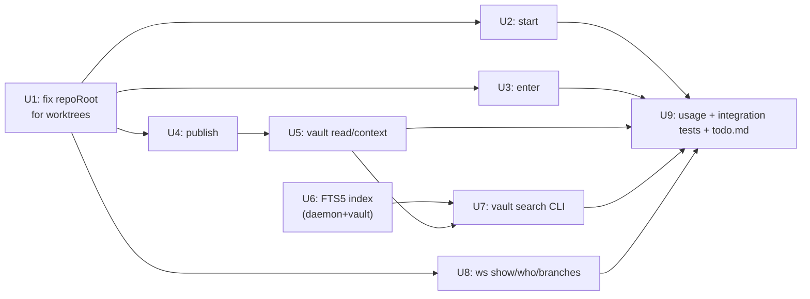

# feat: Complete Kushagra's remaining Phase 1 CLI surface (start/enter/publish/vault/ws)

## Summary

`todo.md` Steps 4/6/8 still list unchecked Kushagra CLI commands: `start`, `enter`, `publish`, `vault read/context/search`, and `ws show/who/branches`. Research into `packages/daemon` and `packages/core/src/contracts` shows the daemon already exposes working endpoints for publish, vault read, vault context, and workspace status (including `participant.branch`) — most of this is thin CLI plumbing. The one exception is `vault search`, which has no backing endpoint anywhere and needs a real indexed-search subsystem. Along the way, research surfaced a load-bearing gap: the CLI's repo-root resolution breaks when run from inside a Teambridge-managed worktree, which every command in this plan except `start` is designed to run from.

## Problem Frame

Kushagra's Phase 1 CLI scope is otherwise complete (`init`, `status`, `project create/list`, `track start`, `track join --as`). The remaining commands are needed to prove the Phase 1 pass example end-to-end: a participant starts or joins a track, publishes into the flat vault, and reads/searches it back — all from inside their own git worktree. Two structural gaps block that flow today:

1. `packages/cli/src/repo.ts#resolveRepoRoot` shells out to `git rev-parse --show-toplevel`, which returns a **linked worktree's own path** when invoked from inside one — not the main repo root where `.teambridge/state.sqlite` and the vault actually live. Every command meant to run post-`enter` (`publish`, `vault read/context/search`) would silently target the wrong (nonexistent) workspace scope.
2. `vault search` has no daemon route, no query schema, and no storage. `PhaseOneVaultFile` content is flat markdown files with no full-text index today.

## Requirements

- R1. `teambridge start <session_name> [base_ref]` performs the same daemon registration as `track start` and additionally creates a real, isolated git worktree + branch for the starter — symmetric with `track join`.
- R2. `teambridge enter <session_name>` prints the absolute worktree path for the current user's participation in that track, suitable for `cd "$(teambridge enter NAME)"`.
- R3. `teambridge publish <target_file> <text>` appends a publish event to the track the current working directory belongs to.
- R4. `teambridge vault read <path>` and `teambridge vault context` return the corresponding vault content for the current track.
- R5. `teambridge vault search <query>` returns ranked matches from a real index, not a full-file scan, and the index stays consistent through `vault rebuild`.
- R6. `teambridge ws show|who|branches <session_name>` print workspace summary, participant list, and participant branches respectively.
- R7. CLI commands invoked from inside a Teambridge-managed worktree resolve to the correct (main) repo root, not the worktree's own toplevel.
- R8. `todo.md` reflects every checkbox this plan closes.

## Key Technical Decisions

- **KTD1 — Vault search index storage: SQLite FTS5, not a hand-rolled inverted index.** The daemon already shells out to the `sqlite3` CLI for all state (`runSql`/`querySql`/`sqlValue` in `packages/daemon/src/index.ts`). FTS5 gives tokenizing, indexing, and `bm25`-style ranking for the cost of one virtual-table `CREATE VIRTUAL TABLE ... USING fts5(...)` and standard `INSERT`/`DELETE`/`MATCH` statements through those same helpers — no new SQLite driver, no hand-rolled tokenizer or TF scorer to maintain and rebuild-test. (Confirmed with user.)
- **KTD2 — `start` creates a real worktree for the starter, matching `join`'s symmetry.** Today `track start` only registers the track with the daemon; the starter has no worktree of their own (only `join` calls `prepareJoinerWorktree`). `start` is the todo.md north-star alias described as the "full worktree+branch flow" — it should not be a behavior-identical rename. (Confirmed with user.)
- **KTD3 — Repo-root resolution must detect linked worktrees.** `git rev-parse --show-toplevel` returns the immediate worktree's path, not the main repo's. `enter`, `publish`, and `vault *` are only meaningful when run from inside a participant's worktree (per the Phase 1 pass example), so `resolveRepoRoot` needs to detect a linked worktree and resolve back to the main repo root before sending `repoRoot` to the daemon. This is a prerequisite for R2-R6, not an optional hardening pass.
- **KTD4 — Current-track resolution comes from the git branch name, not a new flag.** `publish` and `vault *` have no `<session_name>` argument in their todo.md signatures — they operate on "the current track." Branches created by `start`/`join` already encode the session (`teambridge/<session>/<safeName>`, per `lib/naming.ts#branchForParticipant`). Reading `git rev-parse --abbrev-ref HEAD` from the literal invocation cwd (before KTD3's repo-root normalization) and parsing that pattern avoids inventing a second workspace-identity mechanism.

## Scope Boundaries

**In scope:** `start`, `enter`, `publish`, `vault read/context/search`, `ws show/who/branches`, the repo-root worktree-detection fix, and the FTS5 search index (daemon + vault package).

**Deferred to Follow-Up Work:**
- `teambridge ask`/`inbox`/`reply`, MCP HTTP server, Claude Code hook auto-injection (Phase 3 scope).
- Supabase relay, cross-device sync, checkpoint upload/download (Phase 2 scope).
- Daemon background-service / auto-start packaging (noted in todo.md Step 4 as separate infra work).
- Ranking beyond FTS5's built-in `bm25`-style ordering (e.g., recency weighting, per-file boosting) — out of scope unless FTS5's default ordering proves inadequate during implementation.

**Outside this product's identity:** Remote/networked search (Phase 2+); this index is local-only, scoped per repo's `state.sqlite`, matching every other Phase 1 storage decision.

---

## High-Level Technical Design

### Vault search index lifecycle

```mermaid
sequenceDiagram
    participant CLI as teambridge publish/vault search
    participant Daemon
    participant Vault as packages/vault
    participant DB as state.sqlite (FTS5)

    CLI->>Daemon: POST /workspaces/:id/events (publish)
    Daemon->>Vault: materializePublishEvent()
    Vault-->>Daemon: appended line(s)
    Daemon->>DB: INSERT INTO vault_search_index (workspace_id, path, line, seq, text)

    CLI->>Daemon: GET /workspaces/:id/vault/search?q=...
    Daemon->>DB: SELECT ... WHERE vault_search_index MATCH ? ORDER BY rank
    DB-->>Daemon: ranked rows
    Daemon-->>CLI: VaultSearchResult[]

    Note over Daemon,DB: POST /workspaces/:id/vault/rebuild already replays<br/>all events to rebuild vault files; this plan extends<br/>the same replay to DELETE+re-INSERT the index rows,<br/>so rebuild-from-events parity covers search too.
```

### Command dependency order



---

## Implementation Units

### U1. Fix repoRoot resolution for in-worktree CLI invocations

**Goal:** `resolveRepoRoot()` returns the main repo root even when invoked from inside a Teambridge-managed linked worktree, since `enter`, `publish`, and `vault *` are designed to run from there.

**Requirements:** R7 (see KTD3)

**Dependencies:** none

**Files:**
- `packages/cli/src/repo.ts` (modify)
- `packages/cli/test/repo.test.cjs` (new)

**Approach:** Detect a linked worktree via `git rev-parse --path-format=absolute --git-common-dir` vs `git rev-parse --show-toplevel`. When the common-dir's parent differs from the toplevel, cwd is inside a linked worktree — use `git worktree list --porcelain` (mirrors the parsing already in `packages/cli/src/lib/git.ts#listWorktrees`) to find the main worktree entry and return its path. Otherwise return `show-toplevel` unchanged (today's behavior for the main repo root and any non-Teambridge worktree use).

**Patterns to follow:** `packages/cli/src/lib/git.ts#listWorktrees` porcelain-output parsing.

**Test scenarios:**
- Happy path: cwd = main repo root → returns main repo root (unchanged).
- Happy path: cwd = a linked worktree created via `git worktree add` → returns the original main repo root, not the worktree path.
- Edge case: cwd is a subdirectory nested inside a linked worktree → still resolves to the main repo root.
- Error path: cwd not inside any git repository → throws the existing "Not inside a git repository" error unchanged.

**Verification:** Running `teambridge status` from inside a freshly created worktree lists the same projects/tracks as running it from the main repo root.

---

### U2. `teambridge start <session_name> [base_ref]`

**Goal:** North-star alias over `track start` that also creates a real worktree/branch for the starter (KTD2).

**Requirements:** R1

**Dependencies:** U1

**Files:**
- `packages/cli/src/commands/start.ts` (new)
- `packages/cli/src/lib/worktree.ts` (modify — rename `prepareJoinerWorktree`/`rollbackJoinerWorktree` to `prepareParticipantWorktree`/`rollbackParticipantWorktree`; no behavior change, now shared by two roles)
- `packages/cli/src/commands/track.ts` (modify — update import names)
- `packages/cli/src/index.ts` (modify — register `start`)
- `packages/cli/test/worktree.test.cjs` (modify — update renamed imports)
- `packages/cli/test/start.test.cjs` (new)

**Approach:** Call the existing `startTrack` daemon client function to register the track and obtain `baseCommit`, then call `prepareParticipantWorktree` (the renamed join helper) and `writeWorktreePointer(..., role: 'creator')`. On a worktree-step failure after the daemon call succeeded, roll back only the local worktree/branch — the daemon-registered track is not scoped to a single worktree and stays registered, mirroring `track join`'s git-first rollback discipline.

**Patterns to follow:** `packages/cli/src/commands/track.ts#runTrackJoin` (git-first creation, scoped rollback, pointer write, idempotent-reuse messaging).

**Test scenarios:**
- Happy path: `start` registers the track via the daemon and creates a real worktree/branch under `.teambridge/worktrees/<session>/<safeName>`, writing a pointer with `role: 'creator'`.
- Edge case: re-running `start` for a session/display name that already has a registered worktree → reused, not recreated (mirrors join's `reused` case).
- Error path: worktree creation fails after the daemon track already exists → local worktree/branch rolled back, the daemon-registered track is left in place, and a clear error is surfaced (not a silent partial state).
- Integration: after `start`, `teambridge status` and `ws who` (U8) both show the starter as a participant with the created branch.

**Verification:** `teambridge start` produces the same worktree/branch shape as `teambridge track join`, and status/ws commands reflect the new participant immediately.

---

### U3. `teambridge enter <session_name>`

**Goal:** Resolve and print the current user's worktree path for a track, composing with `cd "$(teambridge enter NAME)"`.

**Requirements:** R2

**Dependencies:** U1

**Files:**
- `packages/cli/src/commands/enter.ts` (new)
- `packages/cli/src/index.ts` (modify — register `enter`)
- `packages/cli/test/enter.test.cjs` (new)

**Approach:** Read the local profile's `displayName`, call `readWorktreePointer(repoRoot, sessionName, displayName)`. Print **only** the resolved absolute path to stdout — no other output — so it is safe inside `$(...)` shell substitution; all diagnostics and errors go to stderr.

**Patterns to follow:** `packages/cli/src/lib/pointers.ts#readWorktreePointer`.

**Test scenarios:**
- Happy path: a pointer exists for this session + display name → prints exactly the worktree path to stdout, nothing else.
- Error path: no pointer found (never started/joined this track) → non-zero exit, stderr message naming `teambridge start`/`teambridge track join` as the next step.
- Error path: the pointer exists but the worktree directory no longer exists on disk (manually removed) → clear error rather than silently returning a dead path.

**Verification:** `cd "$(teambridge enter <name>)"` lands in the correct worktree directory for both a `start`-created and a `join`-created participant.

---

### U4. `teambridge publish <target_file> <text>`

**Goal:** Thin wrapper appending a publish event to whichever track the current working directory belongs to (KTD4).

**Requirements:** R3

**Dependencies:** U1

**Files:**
- `packages/cli/src/lib/current-track.ts` (new — houses the branch-name → sessionName → workspace resolution described in KTD4, since U5/U7 need the same logic)
- `packages/cli/src/daemon-client.ts` (modify — add `publishEvent`)
- `packages/cli/src/commands/publish.ts` (new)
- `packages/cli/src/index.ts` (modify — register `publish`)
- `packages/cli/test/publish.test.cjs` (new)
- `packages/cli/test/current-track.test.cjs` (new)

**Approach:** Read `git rev-parse --abbrev-ref HEAD` from the literal invocation cwd (before U1's repo-root normalization changes cwd handling), match it against `teambridge/<session>/<safeName>` (the same shape `lib/naming.ts#branchForParticipant` produces), extract `sessionName`, then resolve the workspace via `listTracks` + session-name match (same lookup pattern `track join` already uses). POST the publish event through the existing `/workspaces/:id/events` route.

**Patterns to follow:** `packages/cli/src/commands/track.ts#runTrackJoin`'s track-lookup-by-sessionName block; `packages/vault/src/index.ts#formatPublishText`'s trim/empty validation (mirror client-side to fail fast).

**Test scenarios:**
- Happy path: run from inside a track worktree, `publish decisions.md "text"` appends successfully; CLI prints confirmation including the resulting `seq`.
- Edge case: text is empty or whitespace-only → rejected client-side with a clear error before any daemon call (mirrors the server-side trim requirement in `formatPublishText`).
- Error path: `target_file` is not one of the Phase 1 flat vault files → the daemon's existing validation error message is passed through unchanged.
- Error path: current branch does not match the `teambridge/<session>/<name>` convention (not inside a track worktree) → clear error telling the user to `cd` into a track worktree via `teambridge enter` first.

**Verification:** After `publish`, `teambridge vault read <target_file>` (U5) shows the appended line.

---

### U5. `teambridge vault read <path>` and `teambridge vault context`

**Goal:** Thin wrappers over the existing vault read/context daemon endpoints, using U4's current-track resolution.

**Requirements:** R4

**Dependencies:** U1, U4

**Files:**
- `packages/cli/src/daemon-client.ts` (modify — add `readVaultFile`, `getVaultContext`)
- `packages/cli/src/commands/vault.ts` (new — houses `read`/`context`/`search` subcommands so they share track resolution; U7 extends this file)
- `packages/cli/src/index.ts` (modify — register `vault read|context|search`)
- `packages/cli/test/vault.test.cjs` (new)

**Approach:** `vault read <path>` prints file content to stdout. `vault context` prints the concatenated context to stdout and a one-line `includedPaths`/`truncated`/`lastSeq` summary to stderr, keeping stdout pipeable.

**Test scenarios:**
- Happy path: `vault read decisions.md` after a publish shows the appended content.
- Happy path: `vault context` returns concatenated content and reports `truncated: false` for a small vault.
- Edge case: `vault context` against a vault whose content exceeds `maxBytes` reports `truncated: true` with only the included paths (matches the daemon's existing truncation behavior — no new truncation logic added client-side).
- Error path: an invalid vault path (not a Phase 1 flat file) → the daemon's existing validation error is passed through.

**Verification:** Reading immediately after publishing shows the new content; context truncation matches the daemon's existing byte-limit behavior exactly.

---

### U6. Vault search index (SQLite FTS5, daemon + vault package)

**Goal:** Real indexed search backing `vault search`, consistent through `vault rebuild` (R5, KTD1).

**Requirements:** R5

**Dependencies:** none (backend-only; sequenced here for narrative clarity, safe to build in parallel with U2-U5)

**Files:**
- `packages/daemon/src/index.ts` (modify — create the FTS5 virtual table in `initializeStateDb`; add `GET /workspaces/:id/vault/search` route)
- `packages/vault/src/index.ts` (modify — index-update hooks in `materializePublishEvent` and `rebuildPhaseOneVault`)
- `packages/core/src/contracts/schemas.ts` (modify — add a query-param validation schema for the search request; `VaultSearchResult`/`VaultSearchResponse` types already exist in `packages/core/src/contracts/vault.ts` and `api.ts` and are unused today)
- `packages/vault/test/search.test.*` (new, matching whatever test convention the vault package already uses — inspect `packages/vault` for existing test tooling before choosing runner)
- `packages/daemon/test/vault-search.test.*` (new, matching existing daemon test conventions)

**Approach:** Add a `vault_search_index` FTS5 virtual table (columns: `workspace_id UNINDEXED`, `path UNINDEXED`, `line UNINDEXED`, `seq UNINDEXED`, `text`) to `initializeStateDb`, alongside the existing `projects`/`tracks`/`participants` tables, through the same `runSql`/`querySql`/`sqlValue` helpers already used everywhere in `packages/daemon/src/index.ts` — no new SQLite driver. On each `materializePublishEvent` call, insert one row per appended line (`workspace_id`, `path`, `line`, `seq`, `text`). On `rebuildPhaseOneVault`, delete all rows for the workspace and re-insert while replaying events in `seq` order — the same replay loop that already rebuilds the vault files, so index rebuild inherits identical consistency guarantees. The search route hands the raw (safely quoted) query string to FTS5's `MATCH`, orders by FTS5's `rank`, and maps rows to the existing `VaultSearchResult` shape.

**Technical design** (directional — illustrates the rebuild-consistency requirement, not literal SQL):
```
on publish(event):
  for each appended line -> INSERT INTO vault_search_index(workspace_id, path, line, seq, text)

on rebuild(workspaceId):
  DELETE FROM vault_search_index WHERE workspace_id = X
  replay all events in seq order -> same per-line INSERT as the publish path
```

**Patterns to follow:** `packages/daemon/src/index.ts`'s existing `runSql`/`querySql`/`sqlValue` shell-out helpers; `packages/vault/src/index.ts#rebuildPhaseOneVault`'s existing replay-from-`events.jsonl` loop (the index update slots into the same loop, not a parallel one).

**Test scenarios:**
- Happy path: publish two lines to different files, search for a term unique to one → returns only that file/line.
- Happy path: a line with two occurrences of the query term ranks above a line with one occurrence (FTS5's `rank` ordering surfaces correctly through the daemon route).
- Edge case: empty query string → daemon returns `INVALID_REQUEST` (mirrors `vault/read`'s required-param pattern) rather than attempting a full-table scan.
- Edge case: a query containing FTS5 special characters (e.g., `"`, `*`) is safely escaped/quoted before reaching `MATCH`, so it neither throws a syntax error nor behaves as an unintended prefix/phrase query.
- Integration: after `POST /workspaces/:id/vault/rebuild`, search results for previously-published content are identical to before the rebuild — the rebuild-from-events parity requirement from Scope Boundaries.

**Verification:** Searching immediately after a publish finds the new line; rebuilding the vault leaves search results for unaffected content unchanged.

---

### U7. `teambridge vault search <query>` CLI wrapper

**Goal:** Thin CLI wrapper over U6's search endpoint, reusing U4/U5's current-track resolution.

**Requirements:** R5

**Dependencies:** U5, U6

**Files:**
- `packages/cli/src/daemon-client.ts` (modify — add `searchVault`)
- `packages/cli/src/commands/vault.ts` (modify — add `search` subcommand)
- `packages/cli/test/vault.test.cjs` (modify)

**Approach:** Print one `path:line: text` line per result, in the order the daemon returns them (already rank-ordered by U6).

**Test scenarios:**
- Happy path: `vault search "invoice state"` after publishing that phrase returns the matching line formatted as `path:line: text`.
- Edge case: no results → a clear "no matches" message on stdout, exit code 0 (not treated as an error).

**Verification:** `teambridge publish decisions.md "invoice state"` followed by `teambridge vault search "invoice state"` returns that line.

---

### U8. `teambridge ws show|who|branches <session_name>`

**Goal:** Thin CLI formatting over the existing track-lookup + workspace-status endpoints, which already return `participant.branch`.

**Requirements:** R6

**Dependencies:** U1

**Files:**
- `packages/cli/src/commands/ws.ts` (new)
- `packages/cli/src/index.ts` (modify — register `ws show|who|branches`)
- `packages/cli/test/ws.test.cjs` (new)

**Approach:** Resolve `sessionName` → workspace via `listTracks` (same lookup pattern as `track join`), then call the existing `getWorkspaceStatus(workspaceId)` client function. `show` prints a workspace summary (session name, base commit, status, participant count). `who` lists participants (display name, status, agent). `branches` lists participant branches. All three share one status fetch.

**Patterns to follow:** `packages/cli/src/commands/track.ts#runTrackJoin`'s track-lookup-by-sessionName block; `packages/cli/src/commands/status.ts`'s formatting style.

**Test scenarios:**
- Happy path: each of `show`/`who`/`branches` against a track with two participants prints the expected fields.
- Error path: unknown session name → the same "not found, start it first" message style as `track join`.

**Verification:** After `start` + `join` on the same track, `ws who` and `ws branches` both list both participants with their correct branches.

---

### U9. Usage text, end-to-end integration test, and todo.md

**Goal:** Wire the new commands into `--help`, prove the full flow against a live daemon, and close out the todo.md checkboxes this plan covers.

**Requirements:** R1-R8

**Dependencies:** U2, U3, U4, U5, U7, U8

**Files:**
- `packages/cli/src/index.ts` (modify — usage text)
- `tests/integration/cli-flow.test.mjs` (modify, or a new sibling file following `tests/integration/helpers.mjs`'s daemon-spinup pattern)
- `todo.md` (modify)

**Test scenarios:**
- Integration: two participants (one via `start`, one via `join`) on one track; one publishes; both can `vault read`/`vault context`/`vault search` the result; `ws who`/`ws branches` show both participants with correct branches. This is the Phase 1 pass example minus the actual agent session.

**Verification:** `pnpm test:integration` passes; `todo.md`'s Step 4/6/8 Kushagra checkboxes and the Phase 1 Pass Example checklist reflect what this plan ships (vault rebuild-from-events already covers itself; this plan doesn't re-verify that item).

---

## Risks & Dependencies

- **FTS5 availability risk:** the daemon shells out to a system `sqlite3` binary rather than bundling one; most modern builds include FTS5, but this isn't guaranteed on every machine. Mitigation: feature-detect at daemon startup (`SELECT sqlite_compileoption_used('ENABLE_FTS5')` or a trial `CREATE VIRTUAL TABLE`) and fail with a clear, actionable error rather than a cryptic SQL error from a later publish/search call.
- **Branch-name parsing fragility (KTD4):** if a user manually renames a track worktree's branch, `publish`/`vault *` lose the ability to infer the current track. This is an accepted Phase 1 limitation (matches the existing convention that branch names are daemon/CLI-owned, not hand-edited) and not solved by this plan.
- **Worktree-detection edge cases (U1):** bare repos, submodule worktrees, or unusual `.git` layouts are out of scope for detection — the fix targets the specific linked-worktree shape `git worktree add` produces, matching what `start`/`join` create.
