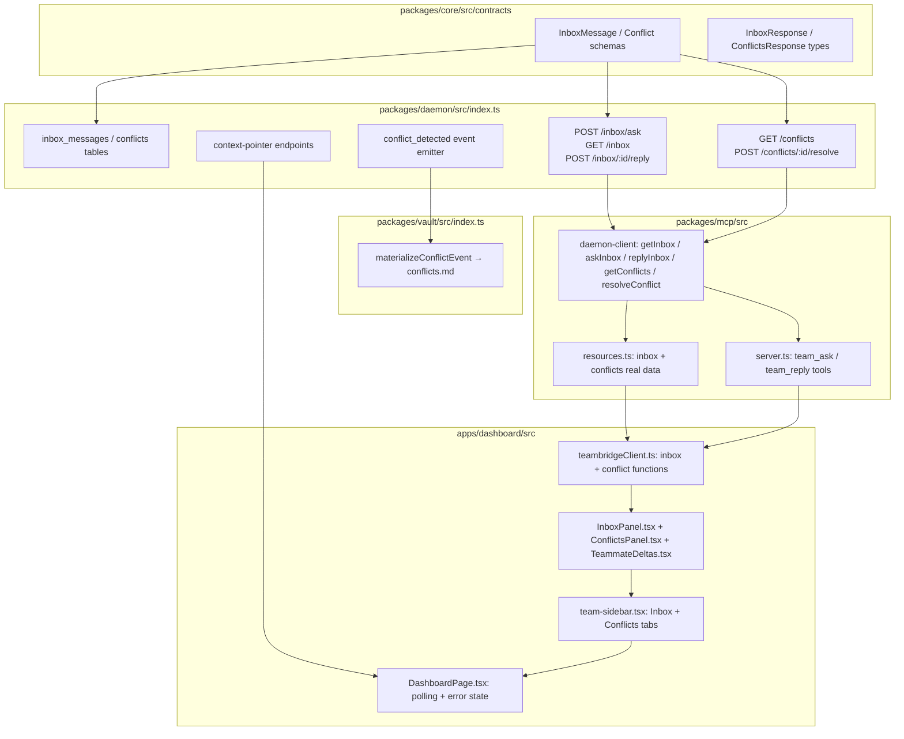

# feat: Inbox, conflicts, and cross-surface interlink for MCP, dashboard, and daemon

## Goal Capsule

- **Objective:** Make the MCP server, dashboard, and daemon interlinked around inbox and conflict workflows. Add the daemon endpoints, core contracts, MCP resources/tools, and dashboard UI that let an agent ask a teammate, a human reply, and the dashboard surface and resolve the resulting messages and conflicts.
- **Authority:** Ronish's remaining Phase 3 scope from `todo.md` and `PROGRESS.md`, with the daemon inbox/conflict endpoints taken on because Nihal's Phase 3 Step 1 has not landed.
- **Stop conditions:** All four live MCP tools call the daemon, dashboard shows inbox/conflicts/deltas with working actions, daemon endpoints persist state and emit events, and per-package tests pass.
- **Execution profile:** Cross-surface feature. Backend-first (contracts + daemon), then MCP, then dashboard, then tests.
- **Tail ownership:** Ronish.

## Product Contract

### Summary

This plan closes the remaining Phase 3 gaps that keep MCP, dashboard, and CLI from being interlinked. It adds daemon HTTP endpoints for inbox ask/list/reply and conflict list/resolve, stores the resulting state in SQLite and `events.jsonl`, and surfaces that state through real MCP resources/tools and new dashboard panels. The CLI `ask`/`inbox`/`reply` commands are intentionally left to Kushagra; the daemon endpoints are designed so Kushagra's CLI can call the same routes.

### Problem Frame

Today the MCP server exposes `teambridge://inbox` and `teambridge://conflicts` as empty stubs, and `team_ask`/`team_reply` return `isError: true`. The dashboard has no inbox or conflict UI. The daemon has no inbox or conflict HTTP endpoints. As a result, the agent can publish and search vault content, but it cannot ask a teammate, see questions, or resolve conflicts — and the dashboard cannot show those workflows either. Once this work lands, an agent can ask a targeted question from the IDE, a teammate can reply from the dashboard, and the team can detect and resolve content conflicts without leaving the shared workspace.

### Requirements

**Inbox**

- R1. The daemon exposes `POST /workspaces/:id/inbox/ask` to create a question from the authenticated local user to a teammate, identified by display name. The `from_user_id` is derived from the local user profile, never from the request body.
- R2. The daemon exposes `GET /workspaces/:id/inbox` to list all messages for a workspace, including pending and answered questions.
- R3. The daemon exposes `POST /workspaces/:id/inbox/:messageId/reply` to answer a pending question, marking the original message as `answered`. Only the message recipient (`to_user_id`) may reply; mismatched callers receive `FORBIDDEN`.
- R4. Asking and replying append `team_ask` / `team_reply` events to `events.jsonl` and persist messages in `inbox_messages` SQLite table.

**Conflicts**

- R5. The daemon detects conflicts during event append and emits `conflict_detected` events. The initial detector flags two publishes to the same `targetFile` within the same sync window.
- R6. The daemon exposes `GET /workspaces/:id/conflicts` to list open conflicts.
- R7. The daemon exposes `POST /workspaces/:id/conflicts/:id/resolve` to resolve a conflict, emitting a `conflict_resolved` event. Resolution is restricted to the local user (any workspace participant may resolve for this MVP); the endpoint guards against resolving an already-resolved conflict.
- R8. Conflicts are materialized into `conflicts.md` in the vault and stored in the `conflicts` SQLite table.

**MCP**

- R9. The MCP resource `teambridge://inbox` returns real messages from the daemon.
- R10. The MCP resource `teambridge://conflicts` returns real conflicts from the daemon.
- R11. The MCP tool `team_ask` calls the daemon ask endpoint instead of returning a stub.
- R12. The MCP tool `team_reply` calls the daemon reply endpoint instead of returning a stub.

**Dashboard**

- R13. The dashboard shows an inbox panel with messages and a reply affordance for pending questions addressed to the local user.
- R14. The dashboard shows a conflicts panel with open conflicts and a resolve affordance.
- R15. The dashboard surfaces recent teammate deltas (publishes since the local user's last-seen seq) using the same context-pointer mechanism as `teambridge context`.
- R16. Dashboard actions call the daemon endpoints and refresh the relevant panels.

**Verification**

- R17. Daemon inbox/conflict behavior is covered by unit tests in `packages/daemon/test/`.
- R18. MCP inbox/conflict tools and resources are covered by integration tests in `packages/mcp/test/`.
- R19. Dashboard inbox/conflicts/deltas panels are covered by component tests in `apps/dashboard/src/components/`.

### Scope Boundaries

**In scope:** Core contract schemas, daemon SQLite tables and HTTP endpoints, vault materialization for conflicts, MCP daemon client additions, MCP resource/tool real implementations, dashboard API client additions, dashboard inbox/conflicts/deltas UI, dashboard integration with the team sidebar, and per-package tests.

**Deferred to Follow-Up Work:**
- CLI `teambridge ask|inbox|reply` commands (Kushagra's Phase 3 Step 3 scope). The daemon endpoints are shaped so the CLI can use them without changes.
- Supabase relay mirroring of `inbox_messages` and `conflicts` to remote `tc_` tables (Phase 2/3 follow-up once local behavior is solid).
- Advanced conflict detection beyond same-targetFile collisions (e.g., semantic merge conflicts, branch-level conflicts).
- Cross-surface end-to-end test that exercises MCP → CLI → dashboard in one flow (out of scope per the planning scope choice; kept as per-package tests).

**Outside this product's identity:** Remote command execution on another teammate's machine, real-time messaging outside the event log, or changing the auth model.

---

## Planning Contract

### Key Technical Decisions

- **KTD1 — Inbox and conflicts are event-sourced through `events.jsonl`.** Every ask, reply, conflict detection, and conflict resolution appends a `WorkspaceEvent` to `events.jsonl` with the same `seq` ordering rules as `publish`. The `events.jsonl` log is the canonical source of truth. The `inbox_messages` and `conflicts` SQLite tables are operational caches populated from those events so endpoints can query by state without replaying the entire log on every request. They are rebuilt from the event log during `POST /workspaces/:id/vault/rebuild` (extended to replay the new event types), keeping the operational cache consistent with the canonical log.

- **KTD2 — Inbox addressing uses display names, resolved to participant IDs locally.** The `AskRequest.to` field is a display name (e.g., `"nihal"`). The daemon resolves it to a `participants.id` row by matching `workspace_id` + `display_name`. If no match exists, the ask fails with a clear error. This matches the existing project roster and participant model and avoids inventing a new identity layer.

- **KTD3 — Conflict detection starts with a simple same-targetFile collision rule.** When a `publish` event arrives for a `targetFile` that has no open conflict and has been published to before, the daemon emits a `conflict_detected` event. Additional publishes to the same `targetFile` while that conflict is open are associated with the existing conflict but do not emit new events. This is intentionally minimal; more sophisticated detectors can be added later without changing the conflict resolution endpoint or UI.

- **KTD4 — Conflicts materialize into `conflicts.md` alongside the Phase 1 flat vault files.** `packages/vault/src/index.ts` gains a `materializeConflictEvent` function that appends a line to `conflicts.md` (the same pattern used for `decisions.md`, `observations.md`, etc.). This keeps the vault the single readable artifact and lets `vault context` include conflict summaries automatically.

- **KTD5 — MCP resources and tools share daemon-client functions with the dashboard.** `packages/mcp/src/daemon-client.ts` adds `getInbox`, `askInbox`, `replyInbox`, `getConflicts`, and `resolveConflict`. The dashboard API client (`apps/dashboard/src/api/teambridgeClient.ts`) calls the same HTTP endpoints. This guarantees that all surfaces read the same state.

- **KTD6 — Teammate deltas use the existing context-pointer file via a new daemon endpoint.** The dashboard cannot read the local filesystem directly, so the daemon exposes `GET /workspaces/:id/context-pointer` and `POST /workspaces/:id/context-pointer`. These read/write the same `.context.{displayName}.json` files that `teambridge context` uses, keeping the dashboard and CLI in sync on "what's new since I last looked."

- **KTD7 — Dashboard reuses the relay-panel tab pattern for inbox and conflicts.** The team sidebar gains fourth and fifth tabs: "Inbox" and "Conflicts". Each panel follows the same polling, error-state, and motion-transition patterns as `RelaySyncHealth` and `EventFeed`.

### Assumptions

- The local user profile and participant rows are stable enough to resolve display names to participant IDs for inbox addressing.
- The existing `WorkspaceEventType` enum (`team_ask`, `team_reply`, `conflict_detected`, `conflict_resolved`) already reflects the intended event shapes.
- The daemon's `runSql`/`querySql` sqlite3 shell-out helpers are sufficient for the new tables and queries.
- The MCP server is already wired to start via `teambridge mcp` and resolve the active workspace from `.teambridge/.active`.

---

## High-Level Technical Design

---

## Implementation Units

### U1. Core contracts: inbox and conflict schemas

**Goal:** Add runtime schemas and response types for inbox and conflict APIs so the daemon, MCP, and dashboard share a single source of truth.

**Requirements:** R1-R8, R9-R12

**Dependencies:** None

**Files:**
- `packages/core/src/contracts/schemas.ts` — add `InboxMessageSchema`, `InboxResponseSchema`, `AskRequestSchema`, `ReplyRequestSchema`, `ConflictSchema`, `ConflictsResponseSchema`, `ResolveConflictRequestSchema`, plus event schemas `TeamAskEventSchema`, `TeamReplyEventSchema`, `ConflictDetectedEventSchema`, `ConflictResolvedEventSchema`.
- `packages/core/src/contracts/api.ts` — add `InboxResponse` and `ConflictsResponse` (if not already present; `InboxResponse` already exists, `ConflictsResponse` is new).
- `packages/core/src/contracts/index.ts` — already re-exports; no change needed.
- `packages/core/test/contracts.test.cjs` — add validation tests for the new schemas.

**Approach:** Keep schemas close to the existing type definitions in `inbox.ts` and `conflicts.ts`. `InboxMessageSchema` mirrors the `InboxMessage` type. `ConflictSchema` mirrors the `Conflict` type. `ConflictsResponse` is `{ conflicts: Conflict[] }`. The event schemas extend the base `WorkspaceEvent` shape with typed payloads (`TeamAskPayload`, `TeamReplyPayload`, `ConflictDetectedPayload`, `ConflictResolvedPayload`) so the daemon, vault, and MCP agree on event shapes. These schemas are used by the daemon request/response body validators and event validators.

**Patterns to follow:** Existing `PublishEventSchema` and `VaultContextSchema` in `packages/core/src/contracts/schemas.ts`.

**Test scenarios:**
- Happy path: `InboxMessageSchema` validates a complete ask message with `status: 'pending'`.
- Happy path: `ConflictSchema` validates a conflict with `status: 'open'` and `affectedPaths`.
- Happy path: `TeamAskEventSchema` validates a `team_ask` event with payload `{ to, text }`.
- Happy path: `ConflictDetectedEventSchema` validates a `conflict_detected` event with payload `{ targetFile, summary }`.
- Error path: `AskRequestSchema` rejects an empty `to` or `text` field.
- Error path: `ReplyRequestSchema` rejects a missing `messageId`.
- Error path: `TeamReplyEventSchema` rejects a `team_reply` event with a missing `replyToMessageId` payload field.
- Type compatibility: a plain `InboxMessage` object is assignable to the inferred schema type.

**Verification:** `pnpm --filter @teambridge/core build && pnpm --filter @teambridge/core test` passes.

---

### U2. Daemon DB tables for inbox and conflicts

**Goal:** Create persistent tables for inbox messages and conflicts in `state.sqlite`.

**Requirements:** R4, R8

**Dependencies:** U1

**Files:**
- `packages/daemon/src/index.ts` — extend `initializeStateDb` with `inbox_messages` and `conflicts` tables.
- `packages/daemon/test/inbox-conflict.test.cjs` (new) — test that the tables are created and can be queried.

**Approach:** Add two `create table if not exists` statements inside `initializeStateDb` after the existing `pending_remote_events` block.

`inbox_messages` columns:
- `id text primary key`
- `workspace_id text not null references tracks(id)`
- `from_user_id text not null`
- `to_user_id text not null`
- `status text not null check (status in ('pending', 'answered', 'expired', 'cancelled'))`
- `body text not null`
- `reply_to text`
- `event_id text not null`
- `created_at text not null`
- `answered_at text`

`conflicts` columns:
- `id text primary key`
- `workspace_id text not null references tracks(id)`
- `kind text not null check (kind in ('content', 'vault', 'branch', 'unknown'))`
- `status text not null check (status in ('open', 'resolved', 'ignored'))`
- `summary text not null`
- `event_ids text not null` (JSON array)
- `affected_paths text` (JSON array)
- `created_at text not null`
- `resolved_at text`
- `resolution_event_id text`

**Patterns to follow:** Existing table definitions in `initializeStateDb` (e.g., `participants`, `pending_remote_events`).

**Test scenarios:**
- Happy path: `initializeStateDb` creates both tables on a fresh repo.
- Happy path: a row can be inserted into each table and read back.
- Edge case: re-running `initializeStateDb` is idempotent (no errors from existing tables).

**Verification:** `pnpm build` succeeds. New daemon tests pass.

---

### U3. Daemon inbox HTTP endpoints

**Goal:** Implement ask, list, and reply endpoints for the team inbox.

**Requirements:** R1-R4

**Dependencies:** U1, U2

**Files:**
- `packages/daemon/src/index.ts` — add route handlers, request body schemas, and helper functions (`createInboxAsk`, `listInboxMessages`, `createInboxReply`).
- `packages/daemon/test/inbox-conflict.test.cjs` — add endpoint tests.

**Approach:**
- `POST /workspaces/:id/inbox/ask` accepts `{ to: string, text: string }`. Resolves `to` display name to a participant ID. Derives `from_user_id` from the local user profile. Creates a `team_ask` event with payload `{ to, text }`, appends it to `events.jsonl`, and inserts a row into `inbox_messages` with `status: 'pending'`. Returns the created `InboxMessage`.
- `GET /workspaces/:id/inbox` returns `InboxResponse` with all messages for the workspace, ordered by `created_at desc`.
- `POST /workspaces/:id/inbox/:messageId/reply` accepts `{ text: string }`. Looks up the message; if not pending or not addressed to the local user, returns an error. Appends a `team_reply` event referencing the original event, updates the message to `status: 'answered'`, sets `answered_at`, and stores the reply text. Returns the updated message.

**Patterns to follow:** Existing `POST /workspaces/:id/events` handler for event append and `rowToParticipant` for participant resolution.

**Test scenarios:**
- Happy path: ask creates a pending message and a `team_ask` event.
- Happy path: reply marks the message answered and creates a `team_reply` event.
- Error path: ask with unknown `to` display name returns `WORKSPACE_NOT_FOUND` or `INVALID_REQUEST`.
- Error path: replying to an already-answered message returns `INVALID_REQUEST`.
- Error path: replying to a message not addressed to the local user returns `FORBIDDEN`.
- Integration: after ask + reply, `GET /inbox` returns both messages in correct order.

**Verification:** `pnpm build` and `pnpm --filter @teambridge/daemon test` pass. The existing `mcp-flow` integration test still passes (stubs are unchanged until U6).

---

### U4. Daemon conflict endpoints and materialization

**Goal:** Detect conflicts, expose list/resolve endpoints, and materialize conflicts into `conflicts.md`.

**Requirements:** R5-R8

**Dependencies:** U1, U2

**Files:**
- `packages/daemon/src/index.ts` — add conflict detection in the publish handler, route handlers, and helper functions (`detectConflicts`, `listConflicts`, `resolveConflict`).
- `packages/vault/src/index.ts` — add `materializeConflictEvent` and register it in the event materialization switch.
- `packages/vault/test/conflict-materialize.test.cjs` (new) — test conflict materialization.
- `packages/daemon/test/inbox-conflict.test.cjs` — add conflict tests.

**Approach:**
- Conflict detection: after a `publish` event is appended, query `conflicts` for an `open` conflict on the same `targetFile`. If none exists and the file has been published to before (detected by querying `events` for prior `publish` events with the same `targetFile`, or by checking the FTS5 search index / vault file), append a `conflict_detected` event with payload `{ targetFile, summary }`. If an open conflict already exists, associate the new publish with it but do not emit a new event. This is the minimal rule from KTD3.
- `GET /workspaces/:id/conflicts` returns `ConflictsResponse` with open conflicts, ordered by `created_at desc`.
- `POST /workspaces/:id/conflicts/:id/resolve` accepts `{ resolutionText: string }`. Appends a `conflict_resolved` event, updates the conflict row to `status: 'resolved'`, sets `resolved_at` and `resolution_event_id`. Returns the updated conflict.
- Materialization: `materializeConflictEvent` appends a bullet line to `conflicts.md` in the same format as other flat vault files.

**Patterns to follow:** Existing `materializePublishEvent` in `packages/vault/src/index.ts` for the flat-file append pattern.

**Test scenarios:**
- Happy path: two publishes to the same target file create a `conflict_detected` event and an open conflict row.
- Happy path: resolving a conflict emits a `conflict_resolved` event and updates the row.
- Happy path: `conflicts.md` contains the conflict summary after materialization.
- Edge case: publishes to different files do not create conflicts.
- Integration: after `POST /workspaces/:id/vault/rebuild`, the `conflicts` and `inbox_messages` tables are consistent with the replayed event log.
- Error path: resolving an already-resolved or nonexistent conflict returns `INVALID_REQUEST`.

**Verification:** `pnpm build` and daemon/vault tests pass.

---

### U5. Context-pointer daemon endpoints

**Goal:** Let the dashboard read and write the same last-seen cursor that `teambridge context` uses, so teammate deltas are consistent across CLI and dashboard.

**Requirements:** R15

**Dependencies:** None

**Files:**
- `packages/daemon/src/index.ts` — add `GET /workspaces/:id/context-pointer` and `POST /workspaces/:id/context-pointer` handlers.
- `packages/core/src/contracts/api.ts` — add `ContextPointerResponse` and `SaveContextPointerRequest` types if not already present.
- `packages/daemon/test/inbox-conflict.test.cjs` — add pointer tests.

**Approach:** Reuse the existing `readContextPointer` / `writeContextPointer` logic from `packages/cli/src/lib/context-pointer.ts`. The daemon endpoints read/write the same JSON file under `.teambridge/workspaces/{sessionName}/.context.{displayName}.json`. The `GET` endpoint returns the pointer; the `POST` endpoint accepts `{ lastSeenSeq: number }` and updates the file. The display name used in the filename is derived from the authenticated local user profile for the workspace, so a participant cannot update another user's pointer.

**Patterns to follow:** The existing pointer file shape and the daemon's `repoRoot` resolution pattern.

**Test scenarios:**
- Happy path: `GET` returns the existing pointer if one exists.
- Happy path: `POST` updates the pointer and a subsequent `GET` returns the new `lastSeenSeq`.
- Edge case: `GET` returns `lastSeenSeq: 0` when no pointer exists.
- Error path: `POST` with an invalid body returns `INVALID_REQUEST`.

**Verification:** Daemon tests pass.

---

### U6. MCP daemon client additions

**Goal:** Add the daemon client functions the MCP server needs to call the new endpoints.

**Requirements:** R9-R12

**Dependencies:** U3, U4, U5

**Files:**
- `packages/mcp/src/daemon-client.ts` — add `getInbox`, `askInbox`, `replyInbox`, `getConflicts`, `resolveConflict`, `getContextPointer`, `setContextPointer`.
- `packages/mcp/test/resources.test.cjs` — add daemon-client tests.

**Approach:** Follow the existing `getJson`/`postJson` patterns. All functions accept `workspaceId` and `DaemonClientOptions`. `askInbox` and `replyInbox` POST with the request body. `resolveConflict` POSTs to `/workspaces/:id/conflicts/:id/resolve`.

**Patterns to follow:** Existing `publishEvent` and `searchVault` in `packages/mcp/src/daemon-client.ts`.

**Test scenarios:**
- Happy path: `getInbox('ws_123', options)` calls `GET /workspaces/ws_123/inbox`.
- Happy path: `askInbox(...)` calls `POST /workspaces/:id/inbox/ask` with the correct body.
- Happy path: `resolveConflict(...)` calls `POST /workspaces/:id/conflicts/:id/resolve`.
- Error path: functions propagate daemon errors as `ApiFail` results.

**Verification:** `pnpm --filter @teambridge/mcp build && pnpm --filter @teambridge/mcp test` passes.

---

### U7. MCP real inbox/conflict resources and tools

**Goal:** Replace the inbox/conflict stubs with real daemon-backed implementations.

**Requirements:** R9-R12

**Dependencies:** U6

**Files:**
- `packages/mcp/src/resources.ts` — update `resolveMcpResource` for `teambridge://inbox` and `teambridge://conflicts` to call the daemon.
- `packages/mcp/src/tools.ts` — replace stubs with real `resolveMcpTool` dispatch for `team_ask` and `team_reply`.
- `packages/mcp/src/server.ts` — update tool descriptions and resource descriptions to remove "not yet implemented" notes.
- `packages/mcp/test/resources.test.cjs` — add tests for real inbox/conflict resource resolution.
- `packages/mcp/test/tools.test.cjs` (new or extend existing) — add tests for `team_ask` and `team_reply` tool dispatch.
- `tests/integration/mcp-flow.test.mjs` — update stub assertions to verify real ask/reply behavior.

**Approach:**
- For `teambridge://inbox`, call `getInbox` and return `{ messages: result.data.messages }`.
- For `teambridge://conflicts`, call `getConflicts` and return `{ conflicts: result.data.conflicts }`.
- For `team_ask`, call `askInbox` and return the created message.
- For `team_reply`, call `replyInbox` and return the updated message.
- If the daemon returns an error, propagate it as a thrown error so the MCP server returns an error response.

**Patterns to follow:** Existing `resolveMcpResource` switch structure and `server.registerTool` pattern.

**Test scenarios:**
- Happy path: reading `teambridge://inbox` returns messages from a mocked daemon reader.
- Happy path: reading `teambridge://conflicts` returns conflicts from a mocked daemon reader.
- Happy path: `team_ask` tool dispatches to `askInbox` and returns the created message.
- Happy path: `team_reply` tool dispatches to `replyInbox` and returns the updated message.
- Error path: daemon failure for any of the above returns an error response.

**Verification:** `pnpm --filter @teambridge/mcp test` passes, including updated integration tests.

---

### U8. Dashboard API client for inbox, conflicts, and context pointers

**Goal:** Add dashboard HTTP client functions for the new daemon endpoints.

**Requirements:** R13-R16

**Dependencies:** U3, U4, U5

**Files:**
- `apps/dashboard/src/api/teambridgeClient.ts` — add `getInbox`, `askInbox`, `replyInbox`, `getConflicts`, `resolveConflict`, `getContextPointer`, `setContextPointer`.
- `apps/dashboard/src/api/teambridgeClient.test.ts` — add tests for the new functions.

**Approach:** Mirror the existing `getJson`/`fetch` POST patterns. `askInbox` and `replyInbox` POST JSON bodies. `resolveConflict` POSTs to the conflict resolve path. `setContextPointer` POSTs `{ lastSeenSeq }`.

**Patterns to follow:** Existing `annotateVaultItem` and `getWorkspaceEvents` in `apps/dashboard/src/api/teambridgeClient.ts`.

**Test scenarios:**
- Happy path: `getInbox` calls `GET /workspaces/:id/inbox` and returns messages.
- Happy path: `askInbox` calls `POST /workspaces/:id/inbox/ask` with `{ to, text }`.
- Happy path: `resolveConflict` calls `POST /workspaces/:id/conflicts/:id/resolve` with `{ resolutionText }`.
- Error path: functions throw with the daemon error message on non-OK responses.

**Verification:** `pnpm --filter @teambridge/dashboard test` passes.

---

### U9. Dashboard inbox panel

**Goal:** Render workspace messages and allow the local user to reply to pending questions.

**Requirements:** R13

**Dependencies:** U8

**Files:**
- `apps/dashboard/src/components/InboxPanel.tsx` (new) — presentational inbox panel.
- `apps/dashboard/src/components/InboxPanel.test.tsx` (new) — component tests.
- `apps/dashboard/src/test/factories.ts` — add `makeInboxMessage` factory.

**Approach:** The component takes `messages: InboxMessage[]`, `localUser: LocalUserProfile | null`, `config: TeambridgeClientConfig`, `workspaceId: string`, and optional `error`. It renders messages grouped by status, with a reply input on pending messages addressed to the local user. On reply, it calls `replyInbox` and notifies the parent via `onReply` so `DashboardPage` can refresh the list.

**Patterns to follow:** `EventFeed.tsx` for row layout, motion transitions, and error handling. `TrackParticipantsPanel.tsx` for participant name display. Use the existing shadcn/ui form primitives for reply/resolve inputs and add clear focus rings and `aria-label`s for accessibility.

**Test scenarios:**
- Happy path: renders a list of pending and answered messages.
- Happy path: shows a reply input only on pending messages addressed to the local user.
- Happy path: submitting a reply calls `replyInbox` and invokes `onReply`.
- Edge case: empty inbox renders a "No messages" placeholder.
- Error state: renders the error message when `error` is set.

**Verification:** `pnpm --filter @teambridge/dashboard test` passes.

---

### U10. Dashboard conflicts panel

**Goal:** Render open conflicts and allow the local user to resolve them.

**Requirements:** R14

**Dependencies:** U8

**Files:**
- `apps/dashboard/src/components/ConflictsPanel.tsx` (new) — presentational conflicts panel.
- `apps/dashboard/src/components/ConflictsPanel.test.tsx` (new) — component tests.
- `apps/dashboard/src/test/factories.ts` — add `makeConflict` factory.

**Approach:** The component takes `conflicts: Conflict[]`, `config`, `workspaceId`, and `error`. It renders open conflicts with their summary, affected paths, and creation time. Each open conflict has a "Resolve" button that opens a small textarea for `resolutionText`. On submit, it calls `resolveConflict` and notifies the parent via `onResolve`.

**Patterns to follow:** `InboxPanel.tsx` (U9) and `RelaySyncHealth.tsx` for panel structure and error handling.

**Test scenarios:**
- Happy path: renders open conflicts with summary and affected paths.
- Happy path: clicking Resolve opens a resolution textarea; submitting calls `resolveConflict`.
- Edge case: no open conflicts renders a "No conflicts" placeholder.
- Error state: renders the error message when `error` is set.

**Verification:** `pnpm --filter @teambridge/dashboard test` passes.

---

### U11. Dashboard teammate deltas

**Goal:** Surface recent teammate publishes since the local user's last-seen seq.

**Requirements:** R15

**Dependencies:** U5, U8

**Files:**
- `apps/dashboard/src/components/TeammateDeltas.tsx` (new) — renders delta entries.
- `apps/dashboard/src/components/TeammateDeltas.test.tsx` (new) — component tests.
- `apps/dashboard/src/lib/delta.ts` (new) — shared delta computation helper.
- `apps/dashboard/src/components/team-sidebar.tsx` — integrate the deltas panel.
- `apps/dashboard/src/pages/DashboardPage.tsx` — poll context pointer + events, compute deltas, handle "mark seen".

**Approach:** Reuse the same delta logic as the CLI (`toDelta` + `renderDeltaLines` shape). The dashboard polls `getWorkspaceEvents` and `getContextPointer` for the selected track. It computes deltas from events with `seq > lastSeenSeq` and type `publish`. Deltas are rendered as a small panel inside the "This Track" tab of the team sidebar, above the participant list. A "Mark seen" button calls `setContextPointer` with the latest event seq.

**Patterns to follow:** CLI `packages/cli/src/commands/context.ts` for delta computation. `EventFeed.tsx` for event list rendering.

**Test scenarios:**
- Happy path: renders delta entries for publish events newer than `lastSeenSeq`.
- Happy path: "Mark seen" calls `setContextPointer` with the latest seq.
- Edge case: no new events renders a "No new updates" placeholder.
- Edge case: events with non-publish types are excluded from deltas.

**Verification:** `pnpm --filter @teambridge/dashboard test` passes.

---

### U12. Dashboard integration and team sidebar tabs

**Goal:** Wire inbox, conflicts, and deltas into the dashboard layout and polling loop.

**Requirements:** R13-R16

**Dependencies:** U9, U10, U11

**Files:**
- `apps/dashboard/src/components/team-sidebar.tsx` — add `inbox` and `conflicts` to `MembersView`, add two new tabs, render the panels.
- `apps/dashboard/src/pages/DashboardPage.tsx` — add `inbox`/`conflicts`/`pointer` state and polling effects, pass data to `TeamSidebar`.
- `apps/dashboard/src/App.test.tsx` — update mock API and add tests for the new tabs.

**Approach:** Expand `MembersView` to `'all' | 'track' | 'relay' | 'inbox' | 'conflicts'`. Add two tab buttons. The inbox and conflicts tabs are scoped to the selected track and poll at the existing `TRACK_REFRESH_MS` cadence. Deltas are rendered as a small panel within the "This Track" tab above the participant list. Pass `inboxError`, `conflictsError`, `inboxMessages`, `conflicts`, `deltas`, `lastSeenSeq`, and `onMarkSeen` to `TeamSidebar`.

**Patterns to follow:** Existing `TeamSidebar` tab structure and `DashboardPage` polling effects for relay status and events.

**Test scenarios:**
- Happy path: clicking the "Inbox" tab renders the `InboxPanel` with messages.
- Happy path: clicking the "Conflicts" tab renders the `ConflictsPanel` with conflicts.
- Happy path: inbox and conflicts are polled for the selected track and refresh when the track changes.
- Error state: the panels show error messages when their respective endpoints fail.
- Integration: switching tracks resets the inbox/conflicts data and polls the new track.

**Verification:** `pnpm build` succeeds. `pnpm --filter @teambridge/dashboard test` and `pnpm test:integration` pass.

---

### U13. Daemon, MCP, and dashboard tests

**Goal:** Add per-package test coverage for the new inbox/conflict/delta behavior.

**Requirements:** R17-R19

**Dependencies:** U3, U4, U5, U7, U9, U10, U11

**Files:**
- `packages/daemon/test/inbox-conflict.test.cjs` (new) — unit tests for DB tables, inbox endpoints, conflict endpoints, context pointer endpoints, and conflict detection.
- `packages/mcp/test/tools.test.cjs` (new or extend `resources.test.cjs`) — unit tests for `team_ask` and `team_reply` dispatch.
- `tests/integration/mcp-flow.test.mjs` — update the stub assertions to verify real ask/reply behavior against a real daemon.
- `apps/dashboard/src/components/InboxPanel.test.tsx`, `ConflictsPanel.test.tsx`, `TeammateDeltas.test.tsx` — component tests (already covered in U9-U11).

**Approach:** Daemon tests spin up a temporary git repo and daemon using the helpers in `tests/integration/helpers.mjs` or a lightweight daemon test harness. MCP tests use the existing mock `McpDaemonReader` pattern. Dashboard tests use the existing factory and render helpers.

**Test scenarios:**
- Daemon: end-to-end ask → reply → list shows correct states.
- Daemon: two publishes to the same file create an open conflict; resolving it emits the right event.
- MCP: `team_ask` and `team_reply` tools return real daemon responses in the integration test.
- Dashboard: `InboxPanel` and `ConflictsPanel` render data and handle actions.

**Verification:** `pnpm test`, `pnpm --filter @teambridge/mcp test`, `pnpm --filter @teambridge/dashboard test`, and `pnpm test:integration` all pass.

---

## Verification Contract

| What | Command | Applies to |
|------|---------|------------|
| Core contract tests | `pnpm --filter @teambridge/core test` | U1 |
| Daemon tests | `pnpm --filter @teambridge/daemon test` | U2-U5, U13 |
| MCP tests | `pnpm --filter @teambridge/mcp test` | U6-U7, U13 |
| Dashboard tests | `pnpm --filter @teambridge/dashboard test` | U8-U12 |
| Full build | `pnpm build` | All units |
| Integration tests | `pnpm test:integration` | U7, U12-U13 |

## Definition of Done

- All 13 implementation units are complete with their test scenarios passing.
- `pnpm build` succeeds with no TypeScript errors.
- `pnpm test:integration` passes, including the updated MCP end-to-end test.
- The MCP `team_ask` and `team_reply` tools call the daemon and return real messages.
- The dashboard has working Inbox and Conflicts tabs with reply and resolve actions.
- The dashboard shows teammate deltas computed from the same context-pointer cursor as the CLI.
- The daemon persists inbox and conflict state in SQLite and emits the corresponding events.
- Conflicts are materialized into `conflicts.md` in the vault.
- No dead-end or experimental code left in the diff.

## System-Wide Impact

- **MCP / dashboard / CLI parity:** the daemon endpoints are the single source of truth for inbox and conflict state. MCP tools, dashboard UI, and (eventually) CLI commands all read and write through the same routes, so a question asked via MCP appears in the dashboard and a reply sent from the dashboard is visible to the MCP tool.
- **Vault materialization:** `conflict_detected` events append to `conflicts.md`, so `vault context` and the vault search index include conflict summaries automatically. This means conflict state is reachable both through the structured API and through the flat vault files.
- **Event log shape:** the plan adds `team_ask`, `team_reply`, `conflict_detected`, and `conflict_resolved` events to `events.jsonl`. These events replay by `seq` and participate in the existing vault rebuild-from-events contract.
- **Context pointer sharing:** the dashboard and CLI share the same `.context.{displayName}.json` read cursor. A "mark seen" action in the dashboard updates the same file that `teambridge context` reads, so the two surfaces stay aligned on what is "new."
- **Permission boundary:** the inbox reply endpoint checks that the local user is the recipient of the message. This is the first per-message authorization check in the daemon and should be reviewed carefully (see Risks & Dependencies).

## Risks & Dependencies

- **Kushagra CLI dependency:** the plan deliberately does not implement `teambridge ask|inbox|reply` CLI commands. Until Kushagra adds them, the CLI cannot drive the new daemon endpoints, but the endpoints are shaped to be compatible.
- **Inbox authorization:** `POST /inbox/:id/reply` must verify that the caller is the message recipient (`to_user_id`). A bug here would let any participant answer questions meant for someone else. Mitigation: the handler looks up the local user profile and compares it to `to_user_id`; mismatch returns `FORBIDDEN`. Add a daemon test that asserts this check.
- **Display-name collision risk:** if two participants share a display name, inbox `to` resolution is ambiguous. Mitigation: the existing `participants` table has a unique `(workspace_id, display_name)` constraint that prevents this at the data layer; the ask handler still validates that exactly one match exists and returns `INVALID_REQUEST` otherwise.
- **Conflict detection false positives:** the simple same-targetFile rule may flag normal sequential publishes as conflicts. Mitigation: the rule is scoped to the same sync window and can be tuned or replaced later without changing the conflict resolution contract.
- **Context-pointer file race:** CLI and dashboard both write the same pointer file. Mitigation: the daemon writes the pointer file atomically using a temp-file + `rename` pattern (or the existing atomic-write helper), so a crash mid-write cannot leave torn JSON. The worst case is a slightly stale `lastSeenSeq` — acceptable for a read cursor.
- **Daemon client timeouts:** the MCP and dashboard HTTP clients need explicit request/response timeouts so a slow daemon cannot hang the agent or the UI. Mitigation: add a timeout to `fetch` calls in `packages/mcp/src/daemon-client.ts` and `apps/dashboard/src/api/teambridgeClient.ts`.
- **Conflict resolution race:** two concurrent resolve requests could both emit `conflict_resolved` events. Mitigation: the update uses `WHERE status = 'open'` (or an optimistic lock) and the handler verifies the row was updated before emitting the event.
- **Polling backpressure:** inbox and conflicts polls at `TRACK_REFRESH_MS` can pile up if the daemon is slow. Mitigation: reuse the existing `AbortController` pattern in `DashboardPage` to cancel in-flight requests when the track changes or a new poll starts.
- **Schema migration:** the new `inbox_messages` and `conflicts` tables are created by `initializeStateDb`, so existing repos pick them up automatically on the next daemon start. No manual migration is needed.

## Sources & Research

- Existing implementation plans: `docs/plans/2026-07-07-001-feat-mcp-server-stdio-resources-tools-plan.md` (MCP server wiring), `docs/plans/2026-07-06-001-feat-relay-dashboard-screens-plan.md` (dashboard panel patterns), `docs/plans/2026-07-06-002-feat-mcp-relay-contracts-plan.md` (MCP resource contracts).
- Existing daemon patterns: `packages/daemon/src/index.ts` for route handlers, `initializeStateDb` for table creation, and the `runSql`/`querySql` sqlite3 shell-out helpers.
- Existing vault patterns: `packages/vault/src/index.ts` for `materializePublishEvent` and the flat-file Phase 1 vault model.
- Existing MCP patterns: `packages/mcp/src/resources.ts`, `packages/mcp/src/server.ts`, `packages/mcp/src/daemon-client.ts`.
- Existing dashboard patterns: `apps/dashboard/src/components/team-sidebar.tsx`, `apps/dashboard/src/components/EventFeed.tsx`, `apps/dashboard/src/components/RelaySyncHealth.tsx`, `apps/dashboard/src/pages/DashboardPage.tsx`.
- Existing CLI context/delta logic: `packages/cli/src/commands/context.ts`, `packages/cli/src/lib/context-pointer.ts`.
